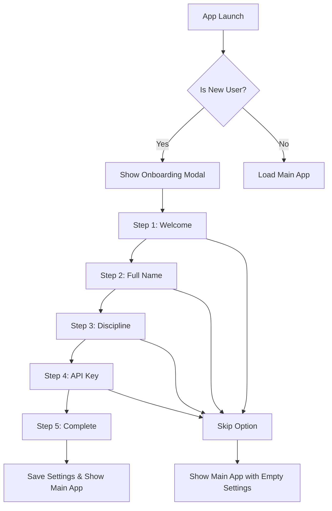

# New User Onboarding Experience Design

## Overview
The ACIES application currently requires users to manually access the settings modal to configure their profile (full name, discipline, API key). For new users, this creates a poor first experience. We need to implement a guided onboarding flow that appears automatically on first launch.

## Current State Analysis
- Settings modal exists with required fields: `userName`, `discipline` (Electrical/Mechanical/Plumbing), `apiKey`
- Settings are saved automatically via debounced input handlers
- No detection for new users - app loads directly to projects tab
- Default settings: `userName: ''`, `discipline: 'Electrical'`, `apiKey: ''`

## Proposed Solution
Create a multi-step onboarding modal that guides new users through setup before showing the main application interface.

## Onboarding Flow Design



## Implementation Steps

### 1. HTML Structure
Add onboarding modal with step navigation:
- Modal header with title and skip button
- Progress indicator showing current step
- Step content areas (welcome, name input, discipline selection, API key input)
- Navigation buttons (Previous/Next/Finish)

### 2. CSS Styling
- Style onboarding modal to match app design
- Add step transition animations
- Progress indicator styling
- Responsive design for different screen sizes

### 3. JavaScript Logic
- New user detection: check if `userSettings.userName` is empty
- Step management: show/hide steps, validate inputs
- Settings integration: populate and save to existing settings system
- Skip functionality: allow users to bypass onboarding
- App initialization: conditionally show onboarding vs main app

### 4. User Experience Considerations
- **Progressive Disclosure**: One concept at a time
- **Validation**: Ensure required fields are filled before proceeding
- **Help Integration**: Link to API key setup help modal
- **Accessibility**: Proper ARIA labels, keyboard navigation
- **Persistence**: Settings saved immediately, onboarding state tracked

## Technical Implementation Details

### New User Detection
```javascript
function isNewUser() {
    return !userSettings.userName || userSettings.userName.trim() === '';
}
```

### Step Management
- Use CSS classes to show/hide steps
- Track current step with variable
- Validate current step before allowing progression
- Update progress indicator

### Settings Integration
- Reuse existing `populateSettingsModal()` and `saveUserSettings()` functions
- Onboarding inputs directly modify `userSettings` object
- Automatic saving via existing debounced handlers

### Modal Structure
```html
<dialog id="onboardingDlg">
    <div class="modal-header">
        <div class="title">Welcome to ACIES!</div>
        <button onclick="skipOnboarding()">Skip Setup</button>
    </div>
    <div class="onboarding-progress">
        <!-- Step indicators -->
    </div>
    <div class="modal-body">
        <!-- Step content -->
    </div>
    <div class="modal-footer">
        <!-- Navigation buttons -->
    </div>
</dialog>
```

## Files to Modify
1. `index.html` - Add onboarding modal HTML
2. `styles.css` - Add onboarding-specific styles
3. `script.js` - Add onboarding logic and integrate with app initialization

## Testing Scenarios
1. **First Launch**: New user sees onboarding, completes all steps
2. **Skip Onboarding**: User clicks skip, settings remain empty
3. **Partial Completion**: User fills some fields, skips, then returns to settings
4. **Returning User**: Existing user with settings doesn't see onboarding
5. **Validation**: Required fields prevent progression until filled

## Success Criteria
- New users are guided through setup without confusion
- Onboarding is skippable for experienced users
- Settings are properly saved and persist across sessions
- UI is consistent with existing app design
- Process is accessible and works on different screen sizes