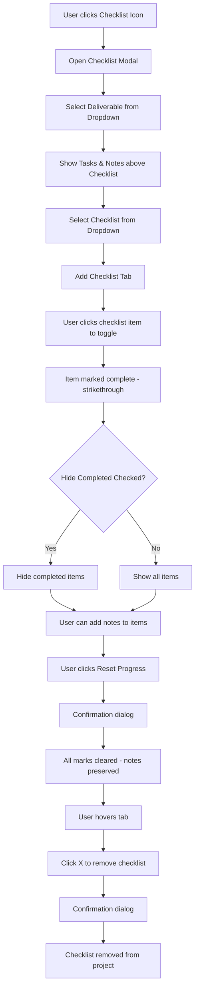

# Checklists Feature Implementation Plan

## Overview
This plan outlines the implementation of a comprehensive checklist feature for the ACIES Project Management application. The feature allows users to create reusable checklists and apply them to project deliverables.

---

## 1. Data Structure

### New Database: `checklistsDb`
```javascript
const checklistsDb = {
  checklists: [
    {
      id: "checklist_default",
      name: "Default",
      isDefault: true,
      isLocked: true, // Cannot be deleted
      items: [
        {
          id: "item_1",
          text: "Verify project requirements",
          order: 0,
          isDefault: true
        },
        {
          id: "item_2",
          text: "Review drawings",
          order: 1,
          isDefault: true
        }
      ]
    },
    {
      id: "checklist_abc123",
      name: "Electrical Submittal",
      isDefault: false,
      isLocked: false,
      items: [
        {
          id: "item_1",
          text: "Compile product data sheets",
          order: 0,
          isDefault: false
        },
        {
          id: "item_2",
          text: "Verify manufacturer qualifications",
          order: 1,
          isDefault: false
        }
      ]
    }
  ],
  lastModified: "2026-02-05T17:00:00.000Z"
}
```

### Project Checklist Application Schema
Each project can track which checklists are applied:
```javascript
project.appliedChecklists = {
  "deliverable_id_1": [
    {
      checklistId: "checklist_default",
      instanceId: "instance_xyz789", // Unique per apply
      completedItems: ["item_1"],
      itemNotes: {
        "item_1": "Completed on 2/5/2026"
      },
      taskReferences: {
        "item_1": "task_id_123" // Link to deliverable task
      }
    }
  ]
}
```

---

## 2. UI Components

### 2.1 Checklists Main Tab
**Location:** New tab in `.main-nav` (after Notes tab)

**Panel Structure:**
```html
<div id="checklists-panel" class="tab-panel" hidden>
  <section class="panel stack">
    <div class="panel-toolbar">
      <div class="toolbar-title">
        <h2 class="section-title">Checklists</h2>
        <p class="tiny muted">Create and manage reusable checklists</p>
      </div>
      <div class="toolbar-actions">
        <button class="btn btn-primary tiny" id="checklistsHelpBtn">?</button>
      </div>
    </div>
    
    <div class="checklists-controls">
      <nav class="inner-tabs" id="checklistsTabsContainer">
        <!-- Checklist tabs rendered here -->
      </nav>
    </div>
    
    <div class="checklist-editor">
      <div class="checklist-header">
        <input type="text" id="checklistName" class="checklist-name-input" placeholder="Checklist Name" />
        <div class="checklist-actions">
          <button class="btn ghost" id="resetChecklistBtn">Reset to Default</button>
          <button class="btn btn-danger ghost" id="deleteChecklistBtn">Delete Checklist</button>
        </div>
      </div>
      
      <div class="checklist-items" id="checklistItemsContainer">
        <!-- Checklist items rendered here -->
      </div>
      
      <div class="checklist-add-item">
        <button class="btn btn-accent tiny" id="addChecklistItemBtn">+ Add Item</button>
      </div>
    </div>
  </section>
</div>
```

### 2.2 Checklist Modal (Project Application)
**Trigger:** 4th icon button in project actions (checklist icon)

**Modal Structure:**
```html
<dialog id="checklistModal" class="checklist-modal">
  <div class="checklist-modal-header">
    <div class="checklist-modal-title">
      <h2 class="title">Project Checklist</h2>
      <p class="tiny muted" id="checklistProjectName">Project Name</p>
    </div>
    <div class="inline">
      <button class="btn ghost" onclick="closeDlg('checklistModal')">Close</button>
      <button class="btn-primary" id="saveChecklistBtn">Save</button>
    </div>
  </div>
  
  <div class="checklist-modal-body">
    <!-- Deliverable Selector -->
    <div class="checklist-deliverable-selector">
      <label class="label">Deliverable</label>
      <select id="checklistDeliverableSelect">
        <!-- Options populated from project deliverables -->
      </select>
    </div>
    
    <!-- Tasks & Notes Section (Above Checklist) -->
    <div class="checklist-tasks-notes-section">
      <div class="section-divider"></div>
      <div class="inline" style="justify-content:space-between">
        <div class="title section-header">Tasks & Notes</div>
        <button class="btn-accent tiny" id="checklistAddTaskBtn">+ Add Task</button>
      </div>
      <div id="checklistTasksContainer" class="checklist-tasks-container">
        <!-- Tasks from selected deliverable -->
      </div>
      <div class="section-divider"></div>
    </div>
    
    <!-- Checklist Tabs -->
    <div class="checklist-tabs-section">
      <div class="checklist-tabs-header">
        <nav class="inner-tabs" id="checklistAppliedTabs">
          <!-- Applied checklist tabs -->
        </nav>
        <div class="checklist-dropdown-selector">
          <select id="checklistAddSelect">
            <option value="">+ Add Checklist...</option>
            <!-- All available checklists -->
          </select>
        </div>
      </div>
      
      <div class="checklist-tab-content" id="checklistTabContent">
        <!-- Active checklist content -->
        <div class="checklist-toggle-row">
          <label class="toggle-label">
            <input type="checkbox" id="hideCompletedChecks" />
            <span>Hide completed items</span>
          </label>
          <button class="btn ghost tiny" id="resetChecklistProgressBtn">Reset Progress</button>
        </div>
        
        <div class="checklist-item-list" id="checklistItemList">
          <!-- Checklist items with checkboxes -->
        </div>
      </div>
    </div>
  </div>
</dialog>
```

---

## 3. Implementation Steps

### Step 1: Data Layer
1. Add `checklistsDb` initialization in `init()`
2. Create `loadChecklists()` function
3. Create `saveChecklists()` function
4. Add default checklist if none exists
5. Integrate checklist storage with pywebview API

### Step 2: Checklists Tab UI
1. Add "Checklists" button to main navigation
2. Create `#checklists-panel` HTML structure
3. Implement `renderChecklistTabs()` function
4. Implement `renderChecklistItems()` function
5. Add checklist CRUD operations:
   - `createChecklist(name)`
   - `deleteChecklist(id)`
   - `renameChecklist(id, newName)`
   - `addChecklistItem(checklistId, text)`
   - `removeChecklistItem(checklistId, itemId)`
   - `updateChecklistItem(checklistId, itemId, text)`
   - `reorderChecklistItem(checklistId, itemId, newOrder)`

### Step 3: Checklist Modal UI
1. Add checklist icon button to project actions
2. Create `#checklistModal` HTML structure
3. Implement `openChecklistModal(projectIndex, deliverableId)` function
4. Implement `renderChecklistDeliverableSelect()` function
5. Implement `renderChecklistAppliedTabs()` function
6. Implement `renderChecklistItems()` for modal
7. Add checklist application logic:
   - `applyChecklistToDeliverable(checklistId, deliverableId)`
   - `removeAppliedChecklist(instanceId)`
   - `toggleChecklistItem(instanceId, itemId)`
   - `addNoteToChecklistItem(instanceId, itemId, note)`
   - `linkTaskToChecklistItem(instanceId, itemId, taskId)`

### Step 4: Integration with Deliverables
1. Display checklist status on deliverable card
2. Show checklist progress (e.g., "3/5 checks complete")
3. Allow opening checklist modal from deliverable card
4. Sync checklist completion with deliverable status

### Step 5: Styling
1. Add CSS for checklist-specific elements
2. Style checklist items with strikethrough animation
3. Style checklist tabs with remove (x) icon on hover
4. Style checklist modal for large display
5. Add toggle switch styling for "Hide completed"

---

## 4. Iconography

```javascript
const CHECKLIST_ICON_PATH = 
  "M19 3H5c-1.1 0-2 .9-2 2v14c0 1.1.9 2 2 2h14c1.1 0 2-.9 2-2V5c0-1.1-.9-2-2-2zm0 16H5V5h14v14zM7 10h2v7H7zm4-3h2v10h-2zm4 6h2v4h-2z";

const CHECK_ICON_PATH = 
  "M9 16.17L4.83 12l-1.42 1.41L9 19 21 7l-1.41-1.41z";

const CLOSE_ICON_PATH = 
  "M19 6.41L17.59 5 12 10.59 6.41 5 5 6.41 10.59 12 5 17.59 6.41 19 12 13.41 17.59 19 19 17.59 13.41 12z";
```

---

## 5. User Interactions

### 5.1 Creating a New Checklist
1. Click "+" button in checklist tabs
2. Enter checklist name in prompt
3. New tab appears, click to select
4. Add items using "+ Add Item" button
5. Items appear as editable text fields with remove (x) button

### 5.2 Applying Checklist to Project
1. Click checklist icon on project row
2. Select deliverable from dropdown (defaults to primary)
3. Tasks and notes appear above checklist
4. Select checklist from "+ Add Checklist" dropdown
5. Checklist tab appears, click to view items
6. Click items to toggle completion (strikethrough)
7. Use "Hide completed" toggle to filter view
8. Add notes to items as needed

### 5.3 Removing Applied Checklist
1. Hover over checklist tab
2. Click (x) icon
3. Confirm deletion dialog appears
4. Checklist removed from project

### 5.4 Resetting Progress
1. Click "Reset Progress" button
2. Confirmation dialog appears
3. All check marks cleared
4. Notes preserved

---

## 6. Database Schema Migration

### New Functions
```javascript
// Checklists I/O
async function loadChecklists() {
  try {
    const data = await window.pywebview.api.get_checklists();
    checklistsDb = data || { checklists: [], lastModified: null };
    return checklistsDb;
  } catch (e) {
    console.warn("Failed to load checklists:", e);
    return { checklists: [], lastModified: null };
  }
}

async function saveChecklists() {
  try {
    checklistsDb.lastModified = new Date().toISOString();
    const response = await window.pywebview.api.save_checklists(checklistsDb);
    if (response.status !== "success") throw new Error(response.message);
  } catch (e) {
    console.warn("Failed to save checklists:", e);
    toast("Failed to save checklists.");
  }
}

// Default checklist factory - Electrical Plan Check Checklist
function getDefaultChecklist() {
  return {
    id: "checklist_default",
    name: "Default",
    isDefault: true,
    isLocked: true,
    items: [
      { id: generateId(), text: "Check relevant codes that apply to the project based on local city, state, and national codes. (CEC 90.2, 90.4)", order: 0, isDefault: true },
      { id: generateId(), text: "Check if the tenant space has existing mechanical units on the roof that are not powered from tenant electrical panels. (CEC 430.102, 440.14)", order: 1, isDefault: true },
      { id: generateId(), text: "Check for unmentioned items that could need power (interior signage). (CEC 600.6)", order: 2, isDefault: true },
      { id: generateId(), text: "Check for occ sensor on ceiling instead of wall in storage room. (Title 24, Part 6 Section 130.1(c)1)", order: 3, isDefault: true },
      { id: generateId(), text: "Check for dedicated service receptacle within 25ft of electrical panels. (CEC 210.63(B)(2), 110.26(E))", order: 4, isDefault: true },
      { id: generateId(), text: "Check for junction box indicated as wall mount for hand dryers. (CEC 314.23, 314.29)", order: 5, isDefault: true },
      { id: generateId(), text: "Check for adequate space for electrical panels, relocate to BOH corridors as necessary, avoid storage rooms, IT server racks. (CEC 110.26(A), 110.26(E))", order: 6, isDefault: true },
      { id: generateId(), text: "Check for food waste disposer for all sinks with outlet under counter and switch above (confirm with plumbing as it is not a requirement). (CEC 422.16(B)(1), 422.31(B))", order: 7, isDefault: true },
      { id: generateId(), text: "Check for furniture systems and include note to verify point of connection for furniture systems. (CEC 605)", order: 8, isDefault: true },
      { id: generateId(), text: "Check for controlled receptacles in office, lobby, kitchen, printer/copy room, conference room, meeting room. Modular furniture workstations need at least one controlled receptacle per workstation. (Title 24, Part 6 Section 130.5(d))", order: 9, isDefault: true },
      { id: generateId(), text: "Check for tamper proof receptacles in areas where children may be present: business offices, lobbies, waiting areas, theaters, auditoriums, gyms, bowling alleys, bus stations, airports, train stations. (CEC 406.12)", order: 10, isDefault: true },
      { id: generateId(), text: "Check for rooftop mechanical units shown on RCP, ensure they are dashed in appearance and noted to go on the roof along with rooftop receptacle. (CEC 210.63(A), 440.14)", order: 11, isDefault: true },
      { id: generateId(), text: "Check for return or supply air system over 2000CFM for duct smoke requirement. Any mechanical units 2000CFM or over should get duct smoke. (Title 24, Part 2 CBC Section 907.2.12.1.2)", order: 12, isDefault: true },
      { id: generateId(), text: "Check for hand dryer specification, if not add note to confirm exact breaker size with manufacturer. (CEC 110.3(B))", order: 13, isDefault: true },
      { id: generateId(), text: "Check for kAIC rating shown on single line main switchboard. (CEC 110.9, 110.10)", order: 14, isDefault: true },
      { id: generateId(), text: "Check for >4000W in space needing demand response. Provide necessary software and device(s) to automatically reducing the lighting power by at least 15% upon receiving a demand response signal. (Title 24, Part 6 Section 110.12)", order: 15, isDefault: true },
      { id: generateId(), text: "Check for GFCI protection at required nonresidential receptacle locations (kitchens, outdoor, rooftops, within 6 ft of sinks, etc.). (CEC 210.8(B))", order: 16, isDefault: true },
      { id: generateId(), text: "Check meeting rooms for required receptacle outlets, including floor outlets when room size thresholds are met. (CEC 210.65)", order: 17, isDefault: true },
      { id: generateId(), text: "Check voltage drop requirements and calculations for feeders and branch circuits (<=5% combined). (Title 24, Part 6 Section 130.5(c))", order: 18, isDefault: true },
      { id: generateId(), text: "Check AIC ratings for panels and transformers on single line. (CEC 110.9, 110.10)", order: 19, isDefault: true },
      { id: generateId(), text: "Check for daylight harvesting in daylit zones. Provide daylight sensor & room controller for automatic dimming of light fixtures. (Title 24, Part 6 Section 130.1(d))", order: 20, isDefault: true },
      { id: generateId(), text: "Check for dimming in all rooms that are BOTH >100sqft AND >0.5W/sqft.", order: 21, isDefault: true },
      { id: generateId(), text: "Check for occupancy sensors which are required in offices, conference & meeting rooms, classrooms, restrooms, multipurpose rooms, warehouses, library aisles, corridors & stairwells.", order: 22, isDefault: true },
      { id: generateId(), text: "Check for time-switch controls which are allowed in lobbies, retail sales floors, commercial kitchens, auditoriums & theaters, and large multipurpose rooms.", order: 23, isDefault: true },
      { id: generateId(), text: "Check for 2-hour bypass switch in each room controlled by automatic time controlled on/off. Provide 1 bypass switch per 5000sqft of room size.", order: 24, isDefault: true },
      { id: generateId(), text: "Check for timeclock to indoor light fixtures that has manual override up to 2-hours, battery or internal memory capable of storing schedule for at least 7 days if power goes out.", order: 25, isDefault: true },
      { id: generateId(), text: "Check for astronomical timeclock, photosensor located on the roof, and contactors with signage, exterior / outdoor lights, pole lights, etc. (Section 130.2(c)2.B)", order: 26, isDefault: true },
      { id: generateId(), text: "Check for spaces that don't require multilevel controls such as: rooms under 100sqft, restrooms, rooms with only one luminaire.", order: 27, isDefault: true }
    ]
  };
}
```

### Python API Endpoints
```python
# In main.py
@api.route('/get_checklists')
def get_checklists():
    try:
        with open(CHECKLISTS_FILE, 'r') as f:
            return json.load(f)
    except FileNotFoundError:
        return {"checklists": [], "lastModified": None}

@api.route('/save_checklists', methods=['POST'])
def save_checklists():
    data = request.json
    with open(CHECKLISTS_FILE, 'w') as f:
        json.dump(data, f, indent=2)
    return {"status": "success"}
```

---

## 7. File Changes Summary

### `index.html`
- Add "Checklists" button to main navigation (after Notes)
- Add `#checklists-panel` tab panel
- Add `#checklistModal` dialog
- Add checklist templates (item row template)

### `script.js`
- Add `checklistsDb` variable
- Add checklist constants and icon paths
- Add `loadChecklists()` and `saveChecklists()` functions
- Add checklist rendering functions
- Add checklist CRUD operations
- Add checklist modal functions
- Add event listeners for checklist UI
- Update `init()` to load checklists
- Update project actions to include checklist button

### `styles.css`
- Add checklist panel styles
- Add checklist modal styles
- Add checklist item styles (strikethrough, checked state)
- Add checklist tab styles
- Add toggle switch styles

---

## 8. Mermaid Diagram: Checklist Application Flow



---

## 9. Implementation Priority

### Phase 1 (High Priority)
- Checklists main tab UI
- Checklist CRUD operations
- Checklist modal basic structure
- Apply checklist to deliverable

### Phase 2 (Medium Priority)
- Checklist item strikethrough animation
- Hide completed toggle
- Reset progress functionality
- Remove checklist tab with confirmation

### Phase 3 (Polish)
- Add notes to checklist items
- Link tasks to checklist items
- Checklist progress indicator on deliverable card
- Visual feedback for checklist status

---

## 10. Questions for Clarification

1. **Default Checklist Items:** Should the default checklist be empty, or pre-populated with standard items?

2. **Checklist Sharing:** Should checklists be shared across users, or stored locally per user?

3. **Checklist Export:** Should checklists be exportable or importable?

4. **Template Checklists:** Should templates have associated checklists that auto-apply?

---

## 11. Files to Modify

| File | Changes |
|------|---------|
| `index.html` | Add checklist tab button, panel, modal |
| `script.js` | Add checklist data layer, UI logic, event handlers |
| `styles.css` | Add checklist-specific styles |
| `main.py` | Add checklist API endpoints |

---

## 12. Estimated Effort

This implementation is estimated to require modifications to:
- **HTML:** ~100 lines added
- **CSS:** ~150 lines added
- **JavaScript:** ~400 lines added
- **Python:** ~30 lines added

Total: ~680 lines of code across 4 files
